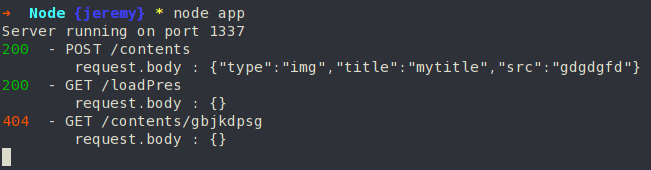

# LivePrez

Github : https://github.com/J-Merle/LivePrez

## Auth JEE

Tout est fonctionnel

## Middle Node

Des configurations postman sont fournies et permettent de tester tous les endpoint.

Il faut bien penser à adapter les chemins dans le fichier `conf.json`.

### ByPass Login
Afin de byPass le login, il suffit de passer la variable `dev` à `true` dans le fichier conf.json

### Ce qui marche

- Interraction avec les objets présentations OK

Methode | Endpoint 
---|---
`GET` | /loadPres
`POST` | /savePres

- Interraction avec les objets content OK

Methode | Endpoint 
---|---
`GET` | /contents
`GET` | /contents/{ID}
`POST` | /contents

- Login OK

### Ce qui marche partiellement

- Websockets

### Ce qui a été fait en plus

Un fonction de log permettant de suivre les appels aux endpoint

## React

### Ce qui marche

- Le côté visual statique avant l'ajout des reducers
- la modification de slid

### Ce qui marche partiellement

- le drag & drop
- la dialog d'ajout 

### Ce qui ne me marche pas
- Je ne suis pas parvenu à faire marcher les reducers complètement
